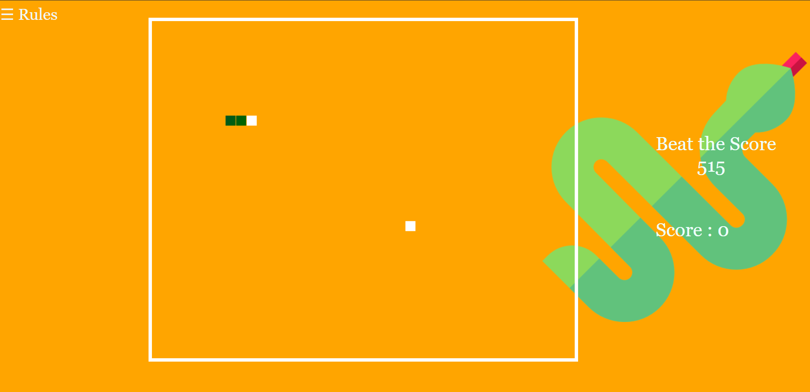
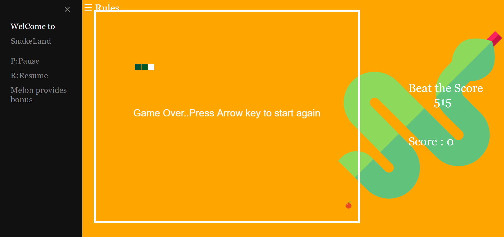

# SnakeLand-Web_Application_Game
SnakeLand (Classic SnakeGame) is a Web Application Game made with the combination of html, css & javaScript, for backEnd: Browser's localStorage is used.

### checkout the insights:
[SnakeLand-The Classic Snake game](https://www.youtube.com/embed/HLmoaXjscQg)

### Installation Steps:

1. Go to *"Clone or Download"* Option.
2. Select *"DownLoad Zip".
3. A Zip file will be downloaded in your desktop.
4. UnZip the file & click on *"game.html"* to play the game.
5. Hurrah! done with the setup. Enjoy the Game :)

### SnakeLand Preview

